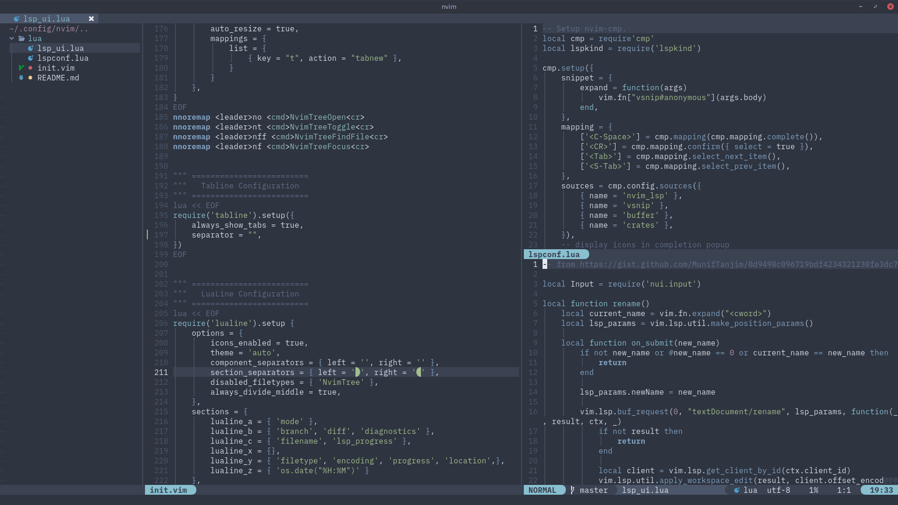

# My Nvim Config 

Works with nvim [0.6](https://github.com/neovim/neovim/releases/tag/v0.6.1) and higher (lower version not tested)

### Plugins 

### Key Bindings 

### Languages supported (via LSP)
